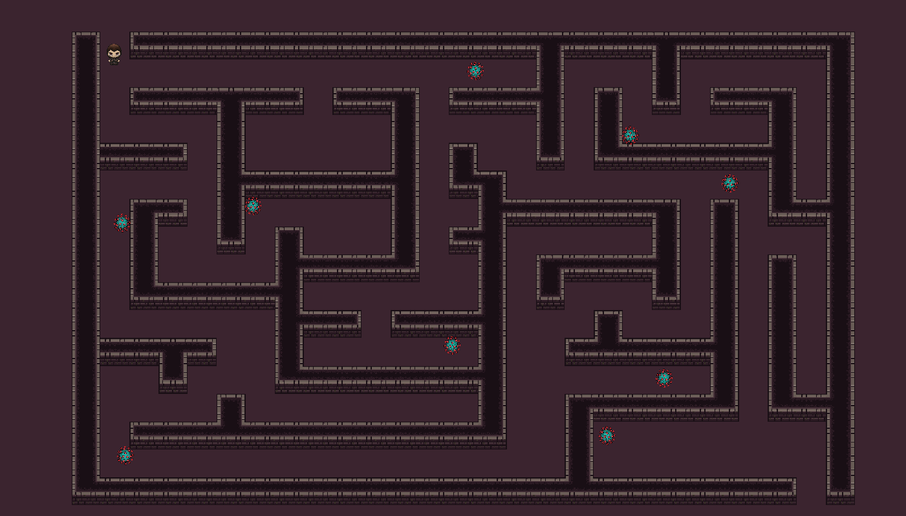
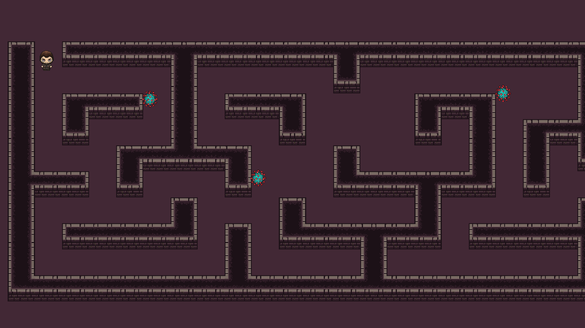

# Covid Maze Runner
A simple 2D game with two levels that was built with unity. The game has a simple objective. The aim is to find the end of the maze and try to not get killed by the coronavirus enimies. 

# Screenshots
## Level 2

## Level 1

# How to run
## Open project in unity
You can run the game by using unity

## Run windows biary
* Download the windows release binary [here](https://github.com/cognitobuoy/Covid-Maze-Runner/releases/tag/1.0.0).
* Extract the files
* Run the Covid Maze Runner.exe
